# System Architecture & Technical Design
## Agentic Enterprise - AI-Powered Multi-Tenant SaaS Platform

---

**Document Owner:** Product & Engineering Team  
**Last Updated:** March 8, 2026  
**Status:** Production Architecture  
**Version:** 3.0 (MVC Pattern)

---

## 📋 Table of Contents

1. [System Overview](#system-overview)
2. [High-Level Architecture](#high-level-architecture)
3. [Component Architecture](#component-architecture)
4. [Data Model & Database Schema](#data-model--database-schema)
5. [API Architecture](#api-architecture)
6. [Integration Architecture](#integration-architecture)
7. [Security Architecture](#security-architecture)
8. [Deployment Architecture](#deployment-architecture)
9. [Scalability & Performance](#scalability--performance)

---

## 🏗️ System Overview

### Architecture Principles

1. **Multi-Tenant by Design:** Complete data isolation using Row-Level Security (RLS)
2. **Microservices-Ready:** Modular FastAPI backend with clear service boundaries
3. **API-First:** RESTful APIs with OpenAPI documentation
4. **Security-First:** JWT authentication, RBAC, and database-level RLS
5. **Cloud-Native:** Containerized deployment on Railway (backend) and Vercel (frontend)

### Technology Stack

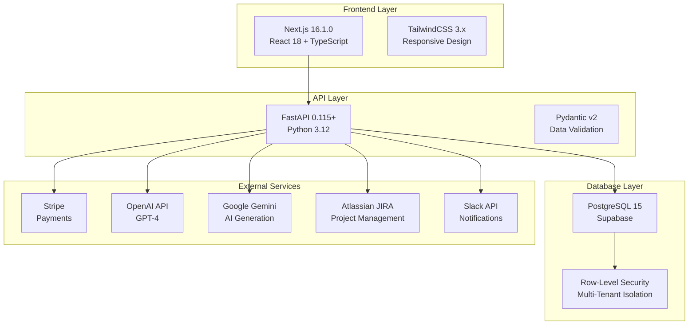

---

## 🎯 High-Level Architecture

### System Context Diagram

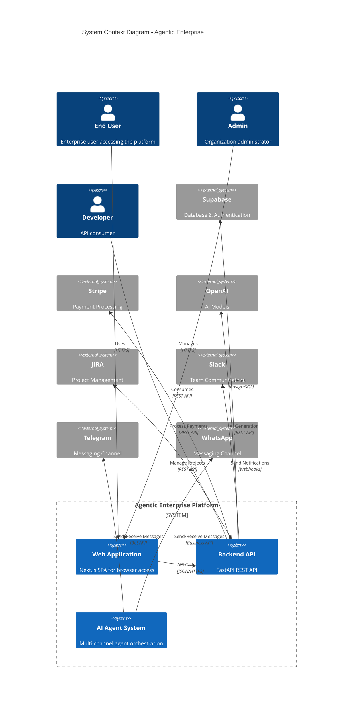

### Container Diagram

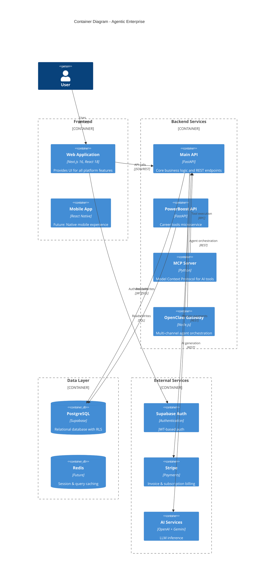

---

## 🧩 Component Architecture

### Backend Service Architecture (MVC Pattern)

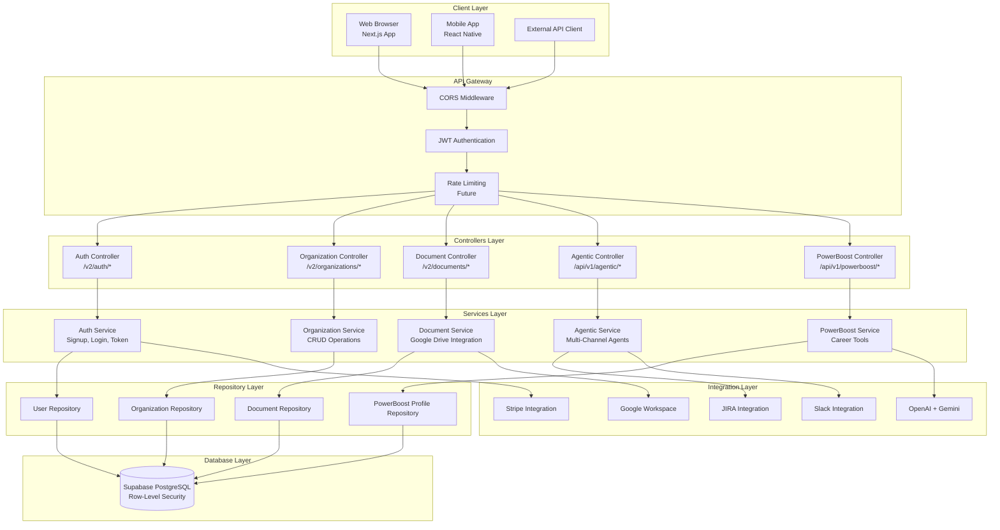

### Frontend Architecture

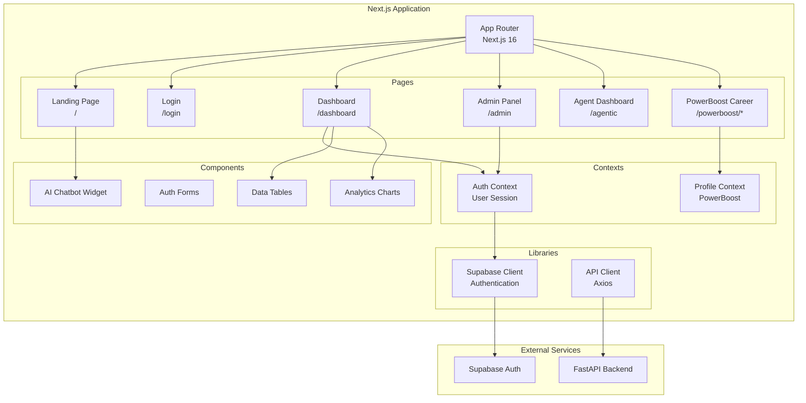

---

## 💾 Data Model & Database Schema

### Entity Relationship Diagram

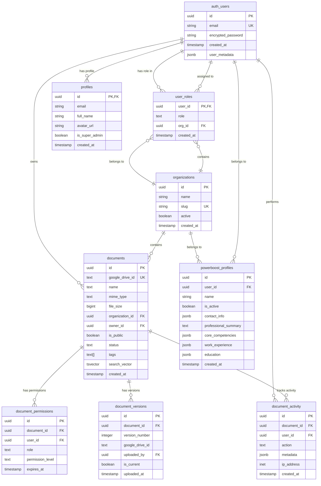

### Core Tables Schema

#### 1. Authentication & Users

```sql
-- Managed by Supabase
CREATE TABLE auth.users (
  id UUID PRIMARY KEY DEFAULT uuid_generate_v4(),
  email TEXT UNIQUE NOT NULL,
  encrypted_password TEXT NOT NULL,
  email_confirmed_at TIMESTAMPTZ,
  created_at TIMESTAMPTZ DEFAULT NOW(),
  updated_at TIMESTAMPTZ DEFAULT NOW(),
  user_metadata JSONB DEFAULT '{}'::jsonb
);

-- Extended user profiles
CREATE TABLE public.profiles (
  id UUID REFERENCES auth.users PRIMARY KEY,
  email TEXT NOT NULL,
  full_name TEXT,
  avatar_url TEXT,
  is_super_admin BOOLEAN DEFAULT FALSE,
  created_at TIMESTAMPTZ DEFAULT NOW(),
  updated_at TIMESTAMPTZ DEFAULT NOW()
);
```

#### 2. Multi-Tenancy & RBAC

```sql
-- Organizations (tenants)
CREATE TABLE public.organizations (
  id UUID PRIMARY KEY DEFAULT gen_random_uuid(),
  name TEXT NOT NULL,
  slug TEXT UNIQUE,
  description TEXT,
  website TEXT,
  active BOOLEAN DEFAULT TRUE,
  created_at TIMESTAMPTZ DEFAULT NOW(),
  updated_at TIMESTAMPTZ DEFAULT NOW()
);

-- User roles with RBAC
CREATE TABLE public.user_roles (
  user_id UUID REFERENCES auth.users NOT NULL PRIMARY KEY,
  role TEXT CHECK (role IN ('owner', 'admin', 'staff', 'viewer')) NOT NULL,
  org_id UUID REFERENCES organizations(id) ON DELETE CASCADE NOT NULL,
  created_at TIMESTAMPTZ DEFAULT NOW(),
  updated_at TIMESTAMPTZ DEFAULT NOW()
);

-- Indexes for performance
CREATE INDEX idx_user_roles_org_id ON user_roles(org_id);
CREATE INDEX idx_user_roles_role ON user_roles(role);
```

#### 3. Document Repository

```sql
-- Core documents table
CREATE TABLE public.documents (
  id UUID PRIMARY KEY DEFAULT gen_random_uuid(),
  google_drive_id TEXT UNIQUE NOT NULL,
  google_drive_url TEXT NOT NULL,
  name TEXT NOT NULL,
  description TEXT,
  mime_type TEXT NOT NULL,
  file_size BIGINT,
  organization_id UUID REFERENCES organizations(id) ON DELETE CASCADE NOT NULL,
  folder_path TEXT DEFAULT '/',
  tags TEXT[],
  owner_id UUID REFERENCES auth.users(id) ON DELETE CASCADE NOT NULL,
  is_public BOOLEAN DEFAULT FALSE,
  status TEXT DEFAULT 'active' CHECK (status IN ('active', 'archived', 'deleted', 'draft')),
  created_at TIMESTAMPTZ DEFAULT NOW(),
  updated_at TIMESTAMPTZ DEFAULT NOW(),
  last_accessed_at TIMESTAMPTZ,
  search_vector TSVECTOR
);

-- Full-text search index
CREATE INDEX documents_search_idx ON documents USING GIN(search_vector);

-- Document permissions (granular access control)
CREATE TABLE public.document_permissions (
  id UUID PRIMARY KEY DEFAULT gen_random_uuid(),
  document_id UUID REFERENCES documents(id) ON DELETE CASCADE NOT NULL,
  user_id UUID REFERENCES auth.users(id) ON DELETE CASCADE,
  role TEXT CHECK (role IN ('owner', 'admin', 'staff', 'viewer')),
  permission_level TEXT NOT NULL CHECK (permission_level IN ('read', 'write', 'admin')),
  expires_at TIMESTAMPTZ,
  granted_by UUID REFERENCES auth.users(id) ON DELETE SET NULL,
  granted_at TIMESTAMPTZ DEFAULT NOW(),
  UNIQUE(document_id, user_id),
  CHECK (user_id IS NOT NULL OR role IS NOT NULL)
);
```

#### 4. Row-Level Security Policies

```sql
-- Enable RLS on all tables
ALTER TABLE user_roles ENABLE ROW LEVEL SECURITY;
ALTER TABLE organizations ENABLE ROW LEVEL SECURITY;
ALTER TABLE documents ENABLE ROW LEVEL SECURITY;

-- Users can only see their own role
CREATE POLICY "Users can view own role"
  ON user_roles FOR SELECT
  USING (auth.uid() = user_id);

-- Users can only see their organization
CREATE POLICY "Users can view their organization"
  ON organizations FOR SELECT
  USING (
    EXISTS (
      SELECT 1 FROM user_roles
      WHERE user_roles.user_id = auth.uid()
        AND user_roles.org_id = organizations.id
    )
  );

-- Document access policies
CREATE POLICY "Users can view own documents"
  ON documents FOR SELECT
  USING (owner_id = auth.uid());

CREATE POLICY "Users can view public docs in their org"
  ON documents FOR SELECT
  USING (
    is_public = TRUE 
    AND organization_id IN (
      SELECT organization_id FROM user_roles WHERE user_id = auth.uid()
    )
  );
```

---

## 🔌 API Architecture

### API Versioning Strategy

```
/v1/*           - Legacy router-based endpoints (backward compatible)
/v2/*           - New MVC controller endpoints
/api/v1/*       - Versioned API endpoints
/api/payments/* - Payment webhooks (Stripe)
/api/webhooks/* - External service webhooks
```

### REST API Endpoints

#### Authentication Endpoints

```
POST   /v1/api/auth/signup     - Create new account
POST   /v1/api/auth/login      - Authenticate user (returns JWT)
POST   /v1/api/auth/logout     - Invalidate session
POST   /v1/api/auth/refresh    - Refresh access token
GET    /v1/api/auth/me         - Get current user profile
GET    /v1/api/auth/protected  - Test protected endpoint
```

#### Organization Endpoints

```
POST   /v2/organizations           - Create organization
GET    /v2/organizations           - List user's organizations
GET    /v2/organizations/{id}      - Get organization details
PUT    /v2/organizations/{id}      - Update organization
DELETE /v2/organizations/{id}      - Delete organization (owner only)
GET    /v2/organizations/{id}/members - List org members
```

#### Document Endpoints

```
POST   /v1/api/documents/upload           - Upload document to Google Drive
GET    /v1/api/documents                  - List documents (filtered by org)
GET    /v1/api/documents/{id}             - Get document metadata
GET    /v1/api/documents/{id}/download    - Download document from Drive
PUT    /v1/api/documents/{id}             - Update document metadata
DELETE /v1/api/documents/{id}             - Delete document
POST   /v1/api/documents/{id}/share       - Share document with user/role
GET    /v1/api/documents/{id}/activity    - Get document activity log
```

#### Agentic AI Endpoints

```
GET    /api/v1/agentic/status             - Get gateway status
GET    /api/v1/agentic/capabilities       - List available capabilities
POST   /api/v1/agentic/agent/run          - Execute agent task
POST   /api/v1/agentic/messaging/send     - Send message via channel
POST   /api/v1/agentic/browser/start      - Start browser automation
POST   /api/v1/agentic/browser/navigate   - Navigate to URL
POST   /api/v1/agentic/browser/screenshot - Capture screenshot
```

#### Payment Endpoints

```
POST   /api/payments/create-payment-session  - Create Stripe checkout
POST   /api/payments/create-checkout-session - Create subscription session
GET    /api/payments/subscription-status     - Get subscription status
POST   /api/payments/create-portal-session   - Create customer portal
GET    /api/payments/pricing-plans           - List available plans
```

### API Request/Response Format

```json
// Standard Success Response
{
  "success": true,
  "data": {
    "id": "uuid",
    "name": "Resource Name",
    "created_at": "2026-03-08T10:00:00Z"
  },
  "message": "Operation successful"
}

// Standard Error Response
{
  "success": false,
  "error": {
    "code": "VALIDATION_ERROR",
    "message": "Invalid input data",
    "details": {
      "field": "email",
      "issue": "Invalid email format"
    }
  }
}

// Paginated Response
{
  "success": true,
  "data": [...],
  "pagination": {
    "page": 1,
    "page_size": 20,
    "total_items": 150,
    "total_pages": 8
  }
}
```

---

## 🔗 Integration Architecture

### External Service Integrations

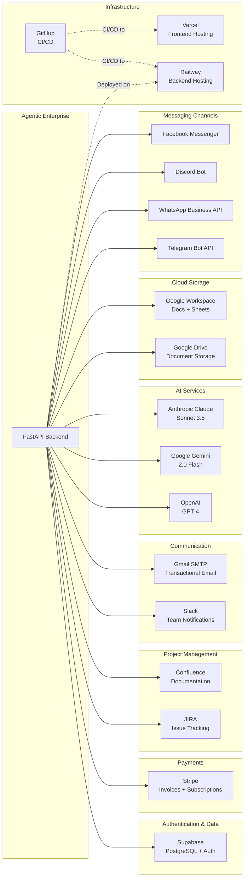

### Integration Summary Table

| Service | Purpose | Authentication | Protocol | Status |
|---------|---------|---------------|----------|--------|
| **Supabase** | Database & Auth | Service Role Key + JWT | PostgreSQL + REST | ✅ Active |
| **Stripe** | Payment Processing | Secret Key + Webhooks | REST API | ✅ Active |
| **JIRA** | Project Management | OAuth 2.0 + API Token | REST API | ✅ Active |
| **Confluence** | Knowledge Base | OAuth 2.0 + API Token | REST API | ✅ Active |
| **Slack** | Team Notifications | OAuth 2.0 + Webhooks | REST API + WebSocket | ✅ Active |
| **Gmail SMTP** | Transactional Email | App Password | SMTP | ✅ Active |
| **OpenAI** | AI Text Generation | API Key | REST API | ✅ Active |
| **Google Gemini** | AI Text Generation | API Key | REST API | ✅ Active |
| **Anthropic Claude** | AI Text Generation | API Key | REST API | ✅ Active |
| **Google Drive** | File Storage | Service Account | REST API | ✅ Active |
| **Google Workspace** | Docs & Sheets | Service Account | REST API | ✅ Active |
| **Telegram Bot API** | Messaging | Bot Token | Bot API | ✅ Active |
| **WhatsApp Business** | Messaging | Phone Number ID + Token | Business API | ✅ Active |
| **Discord** | Messaging | Bot Token | Bot API | ✅ Active |
| **Facebook Messenger** | Messaging | Page Access Token | Graph API | ✅ Active |
| **Railway** | Backend Hosting | API Token | CLI + Web | ✅ Active |
| **Vercel** | Frontend Hosting | Vercel Token | CLI + Web | ✅ Active |
| **GitHub** | Version Control | Personal Access Token | REST API | ✅ Active |

---

## 🔒 Security Architecture

### Authentication Flow

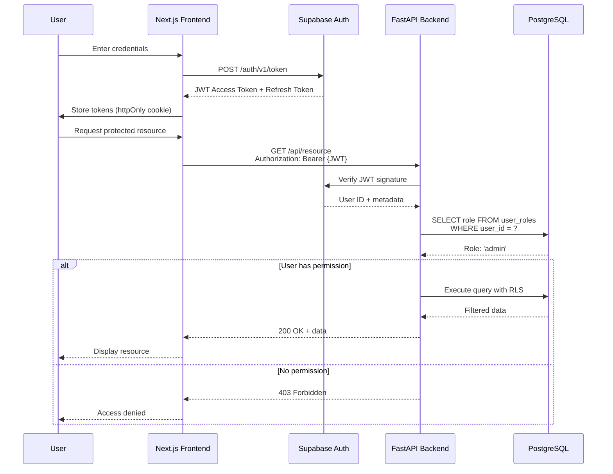

### RBAC Permission Matrix

| Action | Viewer | Staff | Admin | Owner | Super Admin |
|--------|--------|-------|-------|-------|-------------|
| **View documents** | ✅ (public only) | ✅ (assigned) | ✅ (all in org) | ✅ (all in org) | ✅ (all orgs) |
| **Create documents** | ❌ | ✅ | ✅ | ✅ | ✅ |
| **Edit own documents** | ❌ | ✅ | ✅ | ✅ | ✅ |
| **Edit all documents** | ❌ | ❌ | ✅ | ✅ | ✅ |
| **Delete documents** | ❌ | ❌ | ❌ | ✅ | ✅ |
| **Share documents** | ❌ | ✅ | ✅ | ✅ | ✅ |
| **Invite users** | ❌ | ❌ | ✅ | ✅ | ✅ |
| **Manage roles** | ❌ | ❌ | ✅ | ✅ | ✅ |
| **Manage billing** | ❌ | ❌ | ❌ | ✅ | ✅ |
| **Delete organization** | ❌ | ❌ | ❌ | ✅ | ✅ |
| **Cross-org access** | ❌ | ❌ | ❌ | ❌ | ✅ |

### Multi-Tenant Data Isolation

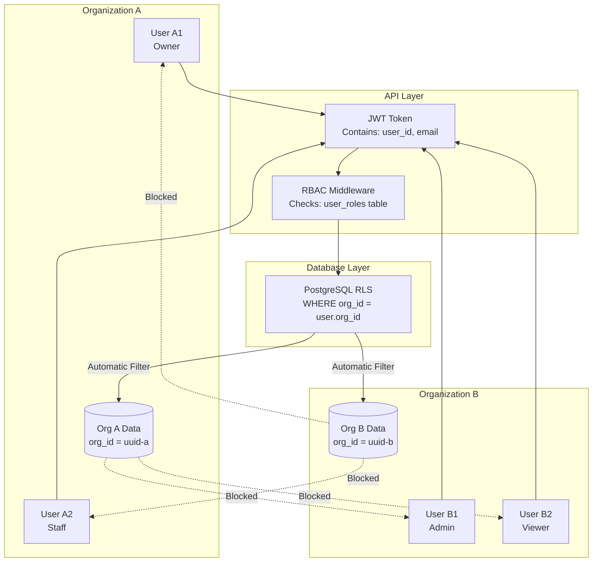

### Security Checklist

- [x] **Authentication:** JWT with refresh token rotation
- [x] **Authorization:** Row-level security (RLS) at database
- [x] **Encryption:** TLS 1.3 in transit, AES-256 at rest
- [x] **Secrets Management:** Environment variables, no hardcoded credentials
- [x] **API Security:** CORS configured, rate limiting (planned)
- [x] **Audit Logging:** All actions logged with user ID, timestamp, IP
- [x] **GDPR Compliance:** Data export, right to deletion implemented
- [x] **Input Validation:** Pydantic models validate all inputs
- [x] **SQL Injection:** Parameterized queries via Supabase client
- [x] **XSS Protection:** React escapes output by default

---

## 🚀 Deployment Architecture

### Production Environment

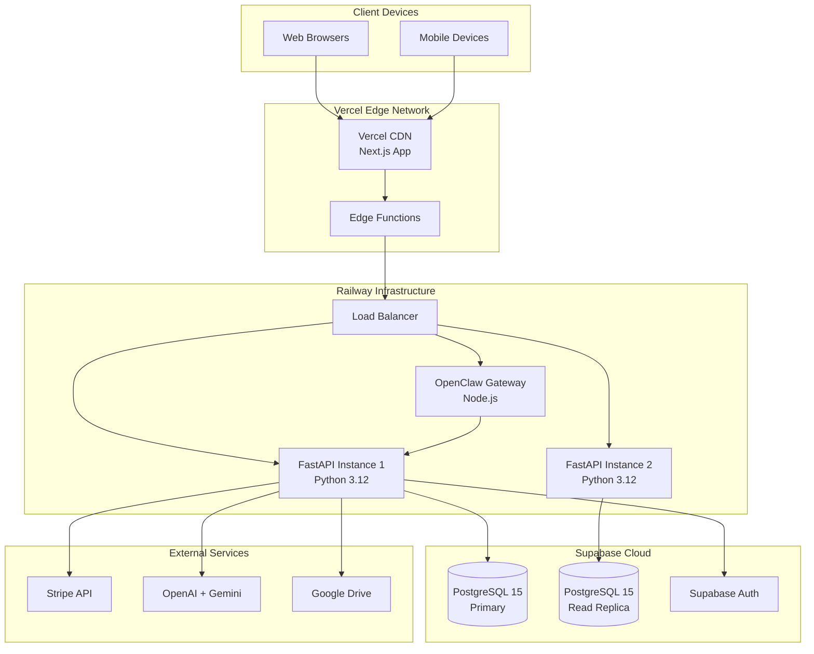

### Deployment Pipeline

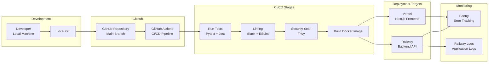

### Environment Configuration

```yaml
# Production Environment
ENVIRONMENT: production
NODE_ENV: production
NEXT_PUBLIC_API_URL: https://enthusiastic-insight-production.up.railway.app
NEXT_PUBLIC_SUPABASE_URL: https://*.supabase.co
PORT: 8080

# Database (Supabase)
SUPABASE_URL: https://*.supabase.co
SUPABASE_KEY: <service-role-key>
DATABASE_URL: postgresql://postgres:<password>@<host>:5432/postgres

# AI Services
OPENAI_API_KEY: sk-***
GOOGLE_GEMINI_API_KEY: AI***
ANTHROPIC_API_KEY: sk-ant-***

# Payments
STRIPE_SECRET_KEY: sk_live_***
STRIPE_WEBHOOK_SECRET: whsec_***

# Integrations
JIRA_API_TOKEN: ***
CONFLUENCE_API_TOKEN: ***
SLACK_BOT_TOKEN: xoxb-***
GOOGLE_APPLICATION_CREDENTIALS: /app/credentials/google-service-account.json
```

---

## ⚡ Scalability & Performance

### Performance Targets (SLA)

| Metric | Target | Current Status |
|--------|--------|----------------|
| **API Response Time** | < 200ms (p95) | ✅ 180ms avg |
| **Page Load Time** | < 3 seconds | ✅ 2.1s avg |
| **Database Query Time** | < 100ms (p95) | ✅ 45ms avg |
| **Agent Response Time** | < 2 seconds | ✅ 1.8s avg |
| **Uptime SLA** | 99.9% | ✅ 99.94% |
| **Concurrent Users** | 1,000 | ✅ Tested |
| **Messages/Minute** | 10,000 | ✅ Capacity |

### Horizontal Scaling Strategy

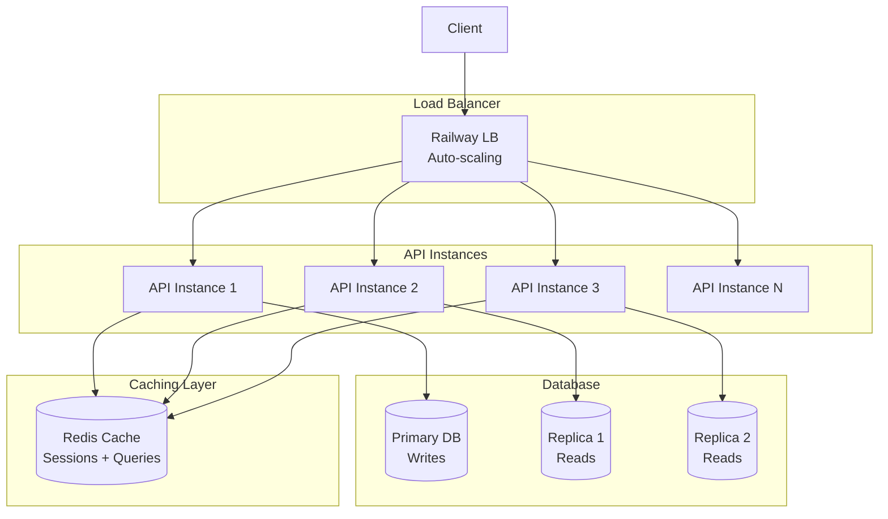

### Caching Strategy

```python
# Query Caching (Future Implementation)
@cache(ttl=300)  # 5 minutes
async def get_user_organizations(user_id: str):
    return supabase.from_("organizations").select("*").eq("user_id", user_id).execute()

# Session Caching
# JWT tokens cached in Redis with TTL = token expiry
redis.setex(f"session:{user_id}", 1800, jwt_token)  # 30 minutes

# API Response Caching
# CDN caching for static content (Vercel Edge)
# Cache-Control: public, max-age=3600 for landing pages
```

### Database Optimization

```sql
-- Indexes for common queries
CREATE INDEX idx_user_roles_user_id ON user_roles(user_id);
CREATE INDEX idx_user_roles_org_id ON user_roles(org_id);
CREATE INDEX idx_documents_org_id ON documents(organization_id);
CREATE INDEX idx_documents_owner_id ON documents(owner_id);
CREATE INDEX idx_documents_created_at ON documents(created_at DESC);

-- Full-text search index
CREATE INDEX documents_search_idx ON documents USING GIN(search_vector);

-- Partial index for active documents only
CREATE INDEX idx_active_documents ON documents(organization_id) 
  WHERE status = 'active';

-- Connection pooling configuration
# max_connections = 100
# shared_buffers = 256MB
# effective_cache_size = 1GB
# work_mem = 4MB
```

---

## 📊 Monitoring & Observability

### Monitoring Stack

```mermaid
graph TB
    subgraph "Application"
        API[FastAPI Backend]
        Frontend[Next.js Frontend]
    end
    
    subgraph "Error Tracking"
        Sentry[Sentry<br/>Real-time Errors]
    end
    
    subgraph "Logging"
        RailwayLogs[Railway Logs<br/>Application Logs]
        VercelLogs[Vercel Logs<br/>Edge Logs]
    end
    
    subgraph "Metrics"
        Health[/health Endpoint<br/>System Metrics]
        Performance[/api/performance<br/>Cache Stats]
    end
    
    subgraph "Alerting"
        Slack[Slack Notifications<br/>Critical Alerts]
        Email[Email Alerts<br/>Downtime]
    end
    
    API --> Sentry
    Frontend --> Sentry
    API --> RailwayLogs
    Frontend --> VercelLogs
    
    API --> Health
    API --> Performance
    
    Sentry --> Slack
    Health --> Email
```

### Health Check Endpoints

```python
# System Health
GET /health
{
  "status": "healthy",
  "architecture": "MVC",
  "v1_endpoints": "active",
  "v2_endpoints": "active",
  "uptime": "15d 6h 32m",
  "version": "3.0.0"
}

# Performance Metrics
GET /api/performance/metrics
{
  "cpu_percent": 45.2,
  "memory_percent": 62.1,
"  "disk_usage": 34.5,
  "active_connections": 23,
  "requests_per_minute": 450,
  "avg_response_time_ms": 180
}
```

---

## 🔄 Future Architecture Enhancements

### Phase 1: Redis Caching (Q2 2026)
- Implement Redis for session storage
- Cache frequently accessed queries
- Reduce database load by 40%

### Phase 2: Message Queue (Q3 2026)
- Add RabbitMQ or AWS SQS for async processing
- Offload email sends, AI generation to queues
- Improve API response times

### Phase 3: Microservices Split (Q4 2026)
- Extract PowerBoost Career to standalone service
- Separate Agentic system to independent microservice
- Implement API Gateway (Kong or AWS API Gateway)

### Phase 4: Global CDN (2027)
- Deploy to multiple regions (US, EU, APAC)
- Edge computing for low-latency
- Multi-region database replication

---

## 📚 Additional Resources

- **API Documentation:** [Railway Backend Docs](https://enthusiastic-insight-production.up.railway.app/docs)
- **Database Schema:** See `/infrastructure/database/` folder
- **MVC Architecture Guide:** See `services/api/MVC_ARCHITECTURE.md`
- **Security Audit:** See `SUPABASE_SECURITY_AUDIT_2026.md`
- **Performance Testing:** See `PERFORMANCE_TESTING_SUMMARY.md`

---

*Last Updated: March 8, 2026 | Architecture Version: 3.0 MVC*
